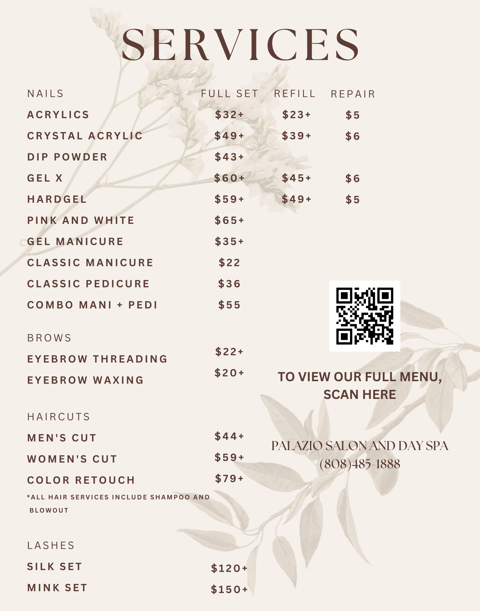

My family runs the Palazio Salon and Day Spa in Pearl City, and I'm in charge of designing the menus, posters, and banners for marketing and promotion.

I use Canva to make my designs, and I try to consider what draws in customers, like what fonts and images are appealing to the intended audience. Most of the designs I make are displayed on poster boards in front of the store and banners on the front window, so it's really important that I make something that will get potential consumer's attention, especially in a high foot-traffic area.

I really enjoy doing these projects because not only do I get to help out my family in some way, I can also get creative. Graphic design is a path I considered because I'm interested in art, but I decided to go the Computer Science route because there's more job potential and diversity, which is why I'm interested in UX/UI Design.

