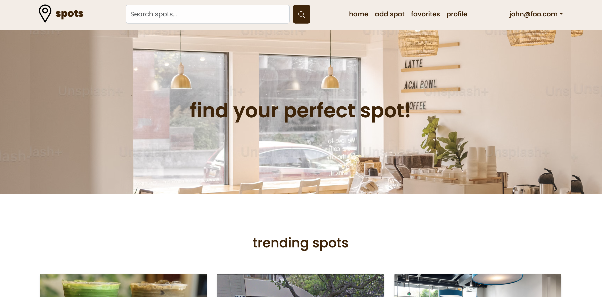

During the Fall semester of my sophomore year, our final project for ICS 314 was to create a Web Application with a team. My team decided to make a website that helps UH Manoa students find study spots around campus.

As college students, we share the struggle of finding a nice spot to study, hangout, relax, or meet new people. In addition, some unicorn places heard about from a friend of a friend are hard to find and might not even be worth the effort and time to get there. We will create a guide to spots on and around campus including a map, descriptions, photos, amenities, a rating system based on quietness, crowd levels, social opportunities, etc. Students can easily find, add, and rate spots, fostering a community of interaction and academic success.

The website features a profile page where one can edit their preferences and profile, a page to add spots for others to discover, and an advanced search option with filters to find spots. On individual spot pages, users can favorite spots and "check in" to let others get an idea of how many people are at a spot. 

Although the website does function, we felt that we could have added more functionality and features to the website if we were given more time. This includes a map feature (similar to yelp or google maps), a friend system, and rating systems. 

You can view our Project Home Page, Github Repository, and Deployment here:

[Project Home Page](https://manoa-spots.github.io/)

[Project Github Repo](https://github.com/manoa-spots/manoa-spots-app)

[Deployment](https://manoa-spots.vercel.app/)

