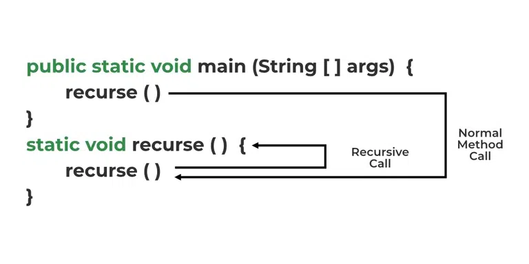

Last year, I made a sudoku solver as the first project I did outside of class. Sudoku is one of my favorite games to play when I pass the time or when I'm bored, so I thought it was a great way to help me improve my skills in Java. It's a simple and common project to make with a lot of different tutorials for it on Youtube, but  nevertheless it helped me to understand the basics of recursion and Java in general.

To use it, you would put the given numbers into the array in the code, and running it would give you the solution.

Here's an excerpt of the code:
```cpp
private static boolean solveBoard(int[][] board) {
    for (int row = 0; row < GRID_SIZE; row++) {
      for (int column = 0; column < GRID_SIZE; column++) {
        if (board[row][column] == 0) {
          for (int tryNumber = 1; tryNumber <= GRID_SIZE; tryNumber++) {
            if (validPlacement(board, tryNumber, row, column)) {
              board[row][column] = tryNumber;
              
              if (solveBoard(board)) {
                return true;
              }
              else {
                board[row][column] = 0;
              }
            }
          }
          return false;
        }
      }
    }
    return true;
  }
```
 

